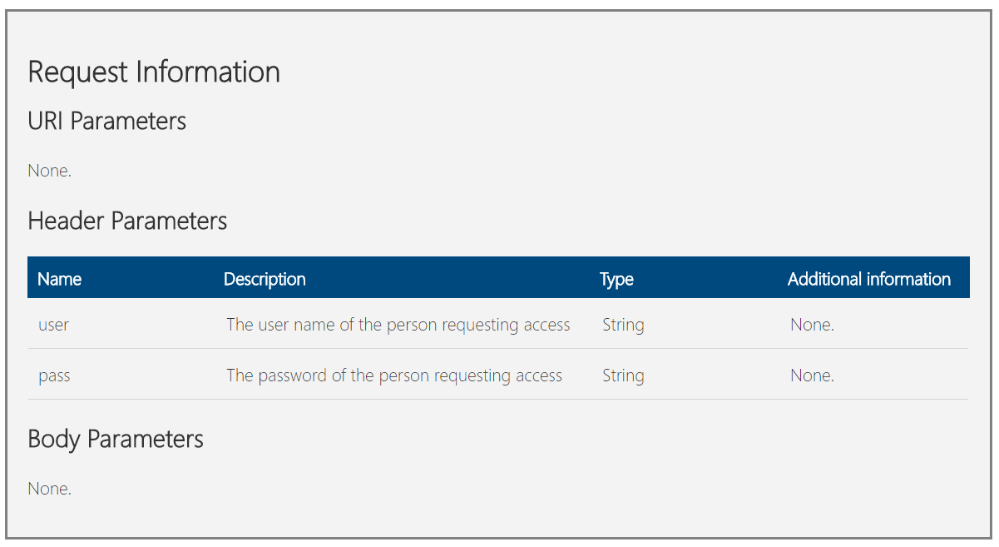

# Asp.Net Web Api Documentation Test

Check out the various commits which show the stages that the project went through.

The end result allows for documentation to be generated for header parameters such as these:

        ''' 

        ''' Log into using the username and password of a staff member
        ''' 

        ''' <header name="user">The user name of the person requesting access</header>
        ''' <header name="pass">The password of the person requesting access</header>
        <HttpGet>

which will generate a section in the documentation like this


